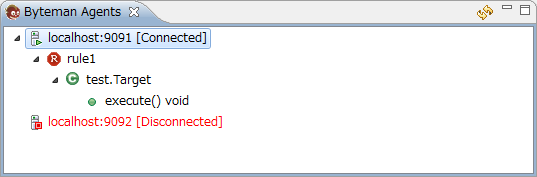

# byteman-editor
==============
### byteman-editor plug-in provides features as follows:
* Syntax validation of Byteman rules.
 * 
* Code completion of the target classes/methods and Byteman rule keywords.
 * 
* Creates a skeleton rule with right click on Java code. 
 * 
* Uploads/unloads rules to an running application with BM agent.
 * 
* Displays methods which rules are applied.
 * 
* etc...

### Set up
* Unzip the plug-in bynary:
 * https://github.com/masao-kunii/byteman-editor/blob/master/jp.co.ntt.oss.jboss.byteman.editor/dropins.zip
* Put them to eclipse dropins folder.

